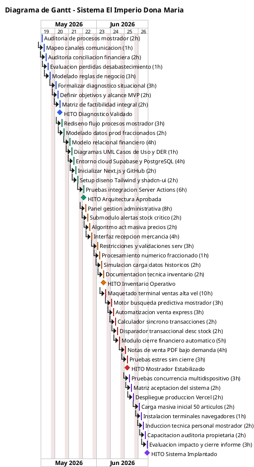

# Diagrama de Gantt — Sistema El Imperio Doña Maria

Copia y pega el contenido de [`./gantt-plantuml.puml`](./gantt-plantuml.puml) en [PlantUML Online](https://www.plantuml.com/plantuml/uml/).

```plantuml
@startgantt
title Diagrama de Gantt - Sistema El Imperio Dona Maria

saturday are closed
sunday are closed
printscale weekly

Project starts 2026/05/04

' ============================================
' FASE I - Observacion (Dias 1-8)
' ============================================
[Auditoria de procesos mostrador (2h)] as [A1] requires 1 day
[A1] is colored in #2563EB/#1D4ED8

[Mapeo canales comunicacion (1h)] as [A2] requires 1 day
[A2] is colored in #2563EB/#1D4ED8
[A2] starts at [A1]'s end

[Auditoria conciliacion financiera (2h)] as [A3] requires 1 day
[A3] is colored in #2563EB/#1D4ED8
[A3] starts at [A2]'s end

[Evaluacion perdidas desabastecimiento (1h)] as [A4] requires 1 day
[A4] is colored in #2563EB/#1D4ED8
[A4] starts at [A3]'s end

[Modelado reglas de negocio (3h)] as [A5] requires 1 day
[A5] is colored in #2563EB/#1D4ED8
[A5] starts at [A4]'s end

[Formalizar diagnostico situacional (3h)] as [A6] requires 1 day
[A6] is colored in #2563EB/#1D4ED8
[A6] starts at [A5]'s end

[Definir objetivos y alcance MVP (2h)] as [A7] requires 1 day
[A7] is colored in #2563EB/#1D4ED8
[A7] starts at [A6]'s end

[Matriz de factibilidad integral (2h)] as [A8] requires 1 day
[A8] is colored in #2563EB/#1D4ED8
[A8] starts at [A7]'s end

[HITO Diagnostico Validado] as [M1] happens at [A8]'s end
[M1] is colored in #2563EB/#1D4ED8

' ============================================
' FASE II - Hipotesis y Diseno (Dias 9-16)
' ============================================
[Rediseno flujo procesos mostrador (3h)] as [A9] requires 1 day
[A9] is colored in #059669/#047857
[A9] starts at [M1]'s end

[Modelado datos prod fraccionados (2h)] as [A10] requires 1 day
[A10] is colored in #059669/#047857
[A10] starts at [A9]'s end

[Modelo relacional financiero (4h)] as [A11] requires 1 day
[A11] is colored in #059669/#047857
[A11] starts at [A10]'s end

[Diagramas UML Casos de Uso y DER (1h)] as [A12] requires 1 day
[A12] is colored in #059669/#047857
[A12] starts at [A11]'s end

[Entorno cloud Supabase y PostgreSQL (4h)] as [A13] requires 1 day
[A13] is colored in #059669/#047857
[A13] starts at [A12]'s end

[Inicializar Next.js y GitHub (2h)] as [A14] requires 1 day
[A14] is colored in #059669/#047857
[A14] starts at [A13]'s end

[Setup diseno Tailwind y shadcn-ui (2h)] as [A15] requires 1 day
[A15] is colored in #059669/#047857
[A15] starts at [A14]'s end

[Pruebas integracion Server Actions (6h)] as [A16] requires 1 day
[A16] is colored in #059669/#047857
[A16] starts at [A15]'s end

[HITO Arquitectura Aprobada] as [M2] happens at [A16]'s end
[M2] is colored in #059669/#047857

' ============================================
' FASE III - Inventario (Dias 17-24)
' ============================================
[Panel gestion administrativa (8h)] as [A17] requires 1 day
[A17] is colored in #D97706/#B45309
[A17] starts at [M2]'s end

[Submodulo alertas stock critico (2h)] as [A18] requires 1 day
[A18] is colored in #D97706/#B45309
[A18] starts at [A17]'s end

[Algoritmo act masiva precios (2h)] as [A19] requires 1 day
[A19] is colored in #D97706/#B45309
[A19] starts at [A18]'s end

[Interfaz recepcion mercancia (4h)] as [A20] requires 1 day
[A20] is colored in #D97706/#B45309
[A20] starts at [A19]'s end

[Restricciones y validaciones serv (3h)] as [A21] requires 1 day
[A21] is colored in #D97706/#B45309
[A21] starts at [A20]'s end

[Procesamiento numerico fraccionado (1h)] as [A22] requires 1 day
[A22] is colored in #D97706/#B45309
[A22] starts at [A21]'s end

[Simulacion carga datos historicos (2h)] as [A23] requires 1 day
[A23] is colored in #D97706/#B45309
[A23] starts at [A22]'s end

[Documentacion tecnica inventario (2h)] as [A24] requires 1 day
[A24] is colored in #D97706/#B45309
[A24] starts at [A23]'s end

[HITO Inventario Operativo] as [M3] happens at [A24]'s end
[M3] is colored in #D97706/#B45309

' ============================================
' FASE IV - Mostrador (Dias 25-32)
' ============================================
[Maquetado terminal ventas alta vel (10h)] as [A25] requires 1 day
[A25] is colored in #DC2626/#B91C1C
[A25] starts at [M3]'s end

[Motor busqueda predictiva mostrador (3h)] as [A26] requires 1 day
[A26] is colored in #DC2626/#B91C1C
[A26] starts at [A25]'s end

[Automatizacion venta express (3h)] as [A27] requires 1 day
[A27] is colored in #DC2626/#B91C1C
[A27] starts at [A26]'s end

[Calculador sincrono transacciones (2h)] as [A28] requires 1 day
[A28] is colored in #DC2626/#B91C1C
[A28] starts at [A27]'s end

[Disparador transaccional desc stock (2h)] as [A29] requires 1 day
[A29] is colored in #DC2626/#B91C1C
[A29] starts at [A28]'s end

[Modulo cierre financiero automatico (5h)] as [A30] requires 1 day
[A30] is colored in #DC2626/#B91C1C
[A30] starts at [A29]'s end

[Notas de venta PDF bajo demanda (4h)] as [A31] requires 1 day
[A31] is colored in #DC2626/#B91C1C
[A31] starts at [A30]'s end

[Pruebas estres sim cierre (3h)] as [A32] requires 1 day
[A32] is colored in #DC2626/#B91C1C
[A32] starts at [A31]'s end

[HITO Mostrador Estabilizado] as [M4] happens at [A32]'s end
[M4] is colored in #DC2626/#B91C1C

' ============================================
' FASE V - Validacion (Dias 33-40)
' ============================================
[Pruebas concurrencia multidispositivo (3h)] as [A33] requires 1 day
[A33] is colored in #7C3AED/#6D28D9
[A33] starts at [M4]'s end

[Matriz aceptacion del sistema (2h)] as [A34] requires 1 day
[A34] is colored in #7C3AED/#6D28D9
[A34] starts at [A33]'s end

[Despliegue produccion Vercel (2h)] as [A35] requires 1 day
[A35] is colored in #7C3AED/#6D28D9
[A35] starts at [A34]'s end

[Carga masiva inicial 50 articulos (2h)] as [A36] requires 1 day
[A36] is colored in #7C3AED/#6D28D9
[A36] starts at [A35]'s end

[Instalacion terminales navegadores (1h)] as [A37] requires 1 day
[A37] is colored in #7C3AED/#6D28D9
[A37] starts at [A36]'s end

[Induccion tecnica personal mostrador (2h)] as [A38] requires 1 day
[A38] is colored in #7C3AED/#6D28D9
[A38] starts at [A37]'s end

[Capacitacion auditoria propietaria (2h)] as [A39] requires 1 day
[A39] is colored in #7C3AED/#6D28D9
[A39] starts at [A38]'s end

[Evaluacion impacto y cierre informe (3h)] as [A40] requires 1 day
[A40] is colored in #7C3AED/#6D28D9
[A40] starts at [A39]'s end

[HITO Sistema Implantado] as [M5] happens at [A40]'s end
[M5] is colored in #7C3AED/#6D28D9

@endgantt
```
