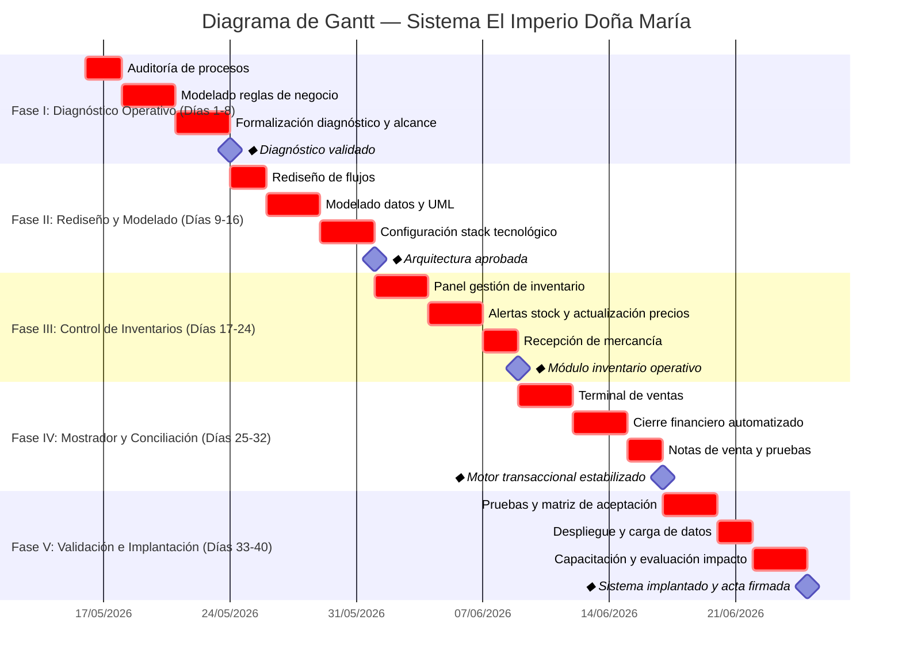

# Diagrama de Gantt — Sistema El Imperio Doña Maria

Diagrama generado con sintaxis Mermaid. Puedes visualizarlo en:
- [Mermaid Live Editor](https://mermaid.live/)
- O directamente en GitHub (soporta Mermaid nativo en bloques ````mermaid`)


