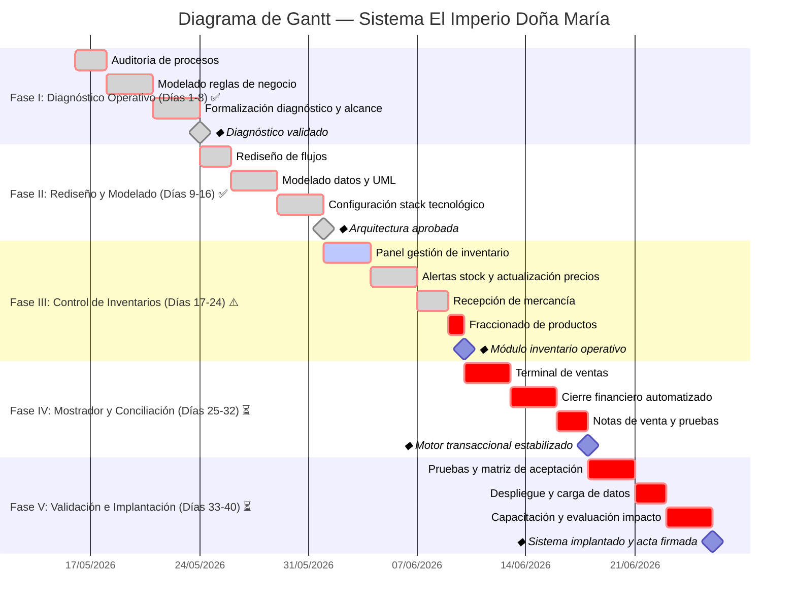

# Diagrama de Gantt — Sistema El Imperio Doña Maria

Diagrama generado con sintaxis Mermaid. Puedes visualizarlo en:
- [Mermaid Live Editor](https://mermaid.live/)
- O directamente en GitHub (soporta Mermaid nativo en bloques ````mermaid`)

> **Estado actual**: 21/06/2026 — Fases I-II ✅ Completas | Fase III ⚠️ En progreso (4/8 tareas) | Fases IV-V ⏳ Pendientes



### Leyenda

| Estado | Símbolo | Significado |
|--------|---------|-------------|
| ✅ Completado | `done` | Tarea finalizada y verificada |
| ⚠️ En progreso | `active` | Tarea en desarrollo activo |
| ⏳ Pendiente | _(sin marca)_ | No iniciada aún |

### Progreso por Fase

| Fase | Avance | Tareas |
|------|--------|--------|
| **I: Diagnóstico** | ✅ 100% (8/8) | Auditoría, modelado reglas, formalización, alcance MVP |
| **II: Rediseño** | ✅ 100% (8/8) | Flujos, datos/UML, stack, pruebas conectividad |
| **III: Inventarios** | ⚠️ 57% (4/7) | ✅ Alertas stock · Actualización precios · Recepción mercancía · Validaciones server-side ⏳ Panel admin · Fraccionado · Seed data · Documentación |
| **IV: Mostrador** | ⏳ 0% (0/8) | POS terminal, búsqueda, venta express, carrito, cierre, PDF, pruebas |
| **V: Implantación** | ⏳ 0% (0/8) | Pruebas concurrencia, deploy, capacitación, evaluación |
