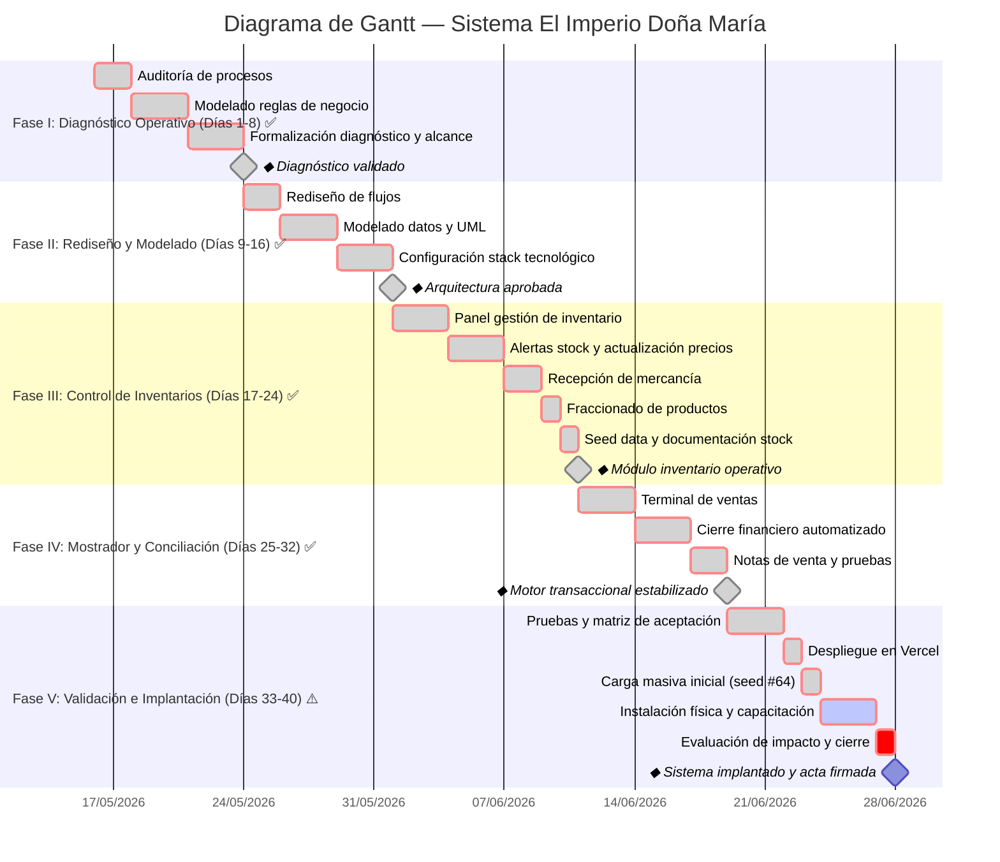

# Diagrama de Gantt — Sistema El Imperio Doña Maria

Diagrama generado con sintaxis Mermaid. Puedes visualizarlo en:
- [Mermaid Live Editor](https://mermaid.live/)
- O directamente en GitHub (soporta Mermaid nativo en bloques ````mermaid`)

> **Estado actual**: 13/08/2026 — Fases I-II ✅ Completas | Fase III ✅ Completa | Fase IV ✅ Completa | Fase V ⚠️ En progreso (4/8 tareas)


```mermaid
gantt
    title Diagrama de Gantt — Sistema El Imperio Doña María
    dateFormat YYYY-MM-DD
    axisFormat %d/%m/%Y
    tickInterval 1week
    weekend saturday

    section Fase I: Diagnóstico Operativo (Días 1-8) ✅
    Auditoría de procesos :done, crit, f1a, 2026-05-16, 2d
    Modelado reglas de negocio :done, crit, f1b, after f1a, 3d
    Formalización diagnóstico y alcance :done, crit, f1c, after f1b, 3d
    ◆ Diagnóstico validado :done, milestone, m1, after f1c, 0d

    section Fase II: Rediseño y Modelado (Días 9-16) ✅
    Rediseño de flujos :done, crit, f2a, after m1, 2d
    Modelado datos y UML :done, crit, f2b, after f2a, 3d
    Configuración stack tecnológico :done, crit, f2c, after f2b, 3d
    ◆ Arquitectura aprobada :done, milestone, m2, after f2c, 0d

    section Fase III: Control de Inventarios (Días 17-24) ✅
    Panel gestión de inventario :done, crit, f3a, after m2, 3d
    Alertas stock y actualización precios :done, crit, f3b, after f3a, 3d
    Recepción de mercancía :done, crit, f3c, after f3b, 2d
    Fraccionado de productos :done, crit, f3d, after f3c, 1d
    Seed data y documentación stock :done, crit, f3e, after f3d, 1d
    ◆ Módulo inventario operativo :done, milestone, m3, after f3e, 0d

    section Fase IV: Mostrador y Conciliación (Días 25-32) ✅
    Terminal de ventas :done, crit, f4a, after m3, 3d
    Cierre financiero automatizado :done, crit, f4b, after f4a, 3d
    Notas de venta y pruebas :done, crit, f4c, after f4b, 2d
    ◆ Motor transaccional estabilizado :done, milestone, m4, after f4c, 0d

    section Fase V: Validación e Implantación (Días 33-40) ⚠️
    Pruebas y matriz de aceptación :done, crit, f5a, after m4, 3d
    Despliegue en Vercel :done, crit, f5b, after f5a, 1d
    Carga masiva inicial (seed #64) :done, crit, f5c, after f5b, 1d
    Instalación física y capacitación :active, crit, f5d, after f5c, 3d
    Evaluación de impacto y cierre :crit, f5e, after f5d, 1d
    ◆ Sistema implantado y acta firmada :milestone, m5, after f5e, 0d
```

### Leyenda

| Estado | Símbolo | Significado |
|--------|---------|-------------|
| ✅ Completado | `done` | Tarea finalizada y verificada |
| ⚠️ En progreso | `active` | Tarea en desarrollo activo |
| ⏳ Pendiente | _(sin marca)_ | No iniciada aún |

### Progreso por Fase

| Fase | Avance | Tareas |
|------|--------|--------|
| **I: Diagnóstico** | ✅ 100% (8/8) | Auditoría, modelado reglas, formalización, alcance MVP |
| **II: Rediseño** | ✅ 100% (8/8) | Flujos, datos/UML, stack, pruebas conectividad |
| **III: Inventarios** | ✅ 100% (8/8) | Panel admin, alertas, precios, recepción, validaciones, fraccionado, seed data (#64), documentación |
| **IV: Mostrador** | ✅ 100% (8/8) | POS terminal, búsqueda, venta express, carrito, cierre, PDF, pruebas |
| **V: Implantación** | ⚠️ 50% (4/8) | ✅ Pruebas concurrencia · Matriz aceptación · Despliegue Vercel · Carga masiva (seed #64) ⏳ Instalación física · Inducción · Capacitación auditoría · Evaluación impacto |
