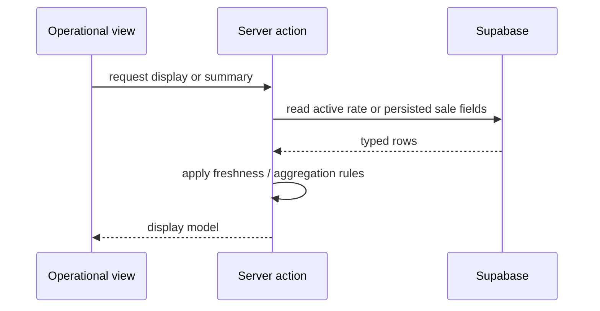

# Design: Display USD/VES Exchange Rate in Operational Views

## Architecture

The change keeps rate ownership in `lib/supabase/actions/tasas.ts` and adds a small display-oriented model rather than duplicating freshness logic in each view. The POS remains a client component and obtains the display model through an authenticated server action. The sales detail and daily close actions select persisted sale conversion fields; they never derive historical VES values from the current rate.

## Data Model

Add nullable fields to `public.ventas` for backward compatibility:

- `tasa_cambio_usd_a_ves numeric(14,4)` — exact rate authorized for the sale.
- `total_ves numeric(14,2)` — USD sale total converted with the applied rate.

The migration updates `create_sale_with_movements` to receive the authorized rate and insert both values atomically. Existing rows remain nullable and are displayed as unavailable when fields are absent.

## Rate Display Model

Introduce a typed model with:

- `tasa: number | null`
- `fuente: string | null`
- `createdAt: string | null`
- `status: "current" | "stale" | "unavailable"`

`getCurrentExchangeRateDisplay` calls the existing current-rate query and maps its result through `isExchangeRateStale`. It preserves the existing raw `getCurrentExchangeRate` contract for `/rates`.

## View Integration

- POS: load the display model once on mount and render it in the payment summary. The existing sale guard remains authoritative; the indicator is informational and reflects the same current-rate policy.
- Sale detail: render `sale.total` as USD, `sale.total_ves` as VES, and `sale.tasa_cambio_usd_a_ves` as the applied rate. Missing historical fields render an explicit unavailable marker.
- Daily close: extend the summary query to aggregate persisted `total_ves` and collect distinct applied rates. The UI shows one rate when all sales share it, `Tasas mixtas` when several exist, and `Sin tasa histórica` when none exists.

## Sequence

## TDD Strategy

1. Add failing unit/action tests for rate display mapping, stale/unavailable states, and sale payload rate propagation.
2. Add failing component tests for POS and sale detail rendering, including legacy unavailable state.
3. Add failing daily-close tests for one rate, mixed rates, and no historical rate.
4. Implement the migration, action contracts, and UI changes until the focused tests pass.
5. Run the full `pnpm check` gate.

## Compatibility and Rollback

The migration uses nullable columns so existing sales remain readable. The RPC signature change is deployed through a new migration that drops/recreates the existing function signature as required by PostgreSQL. Rollback consists of reverting application changes and the migration in the normal Supabase migration process; no rate-provider data is deleted.
